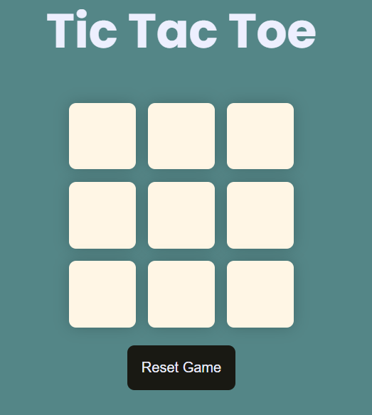
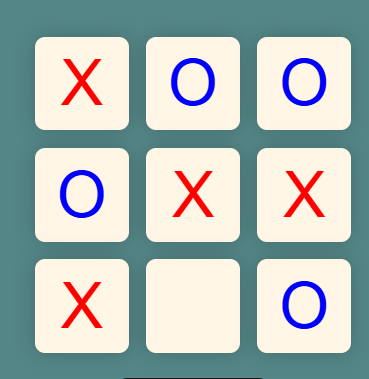
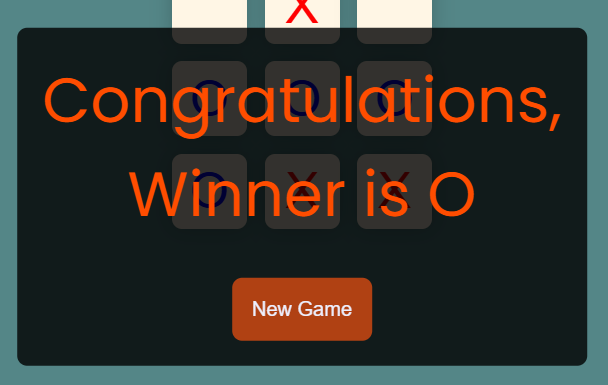
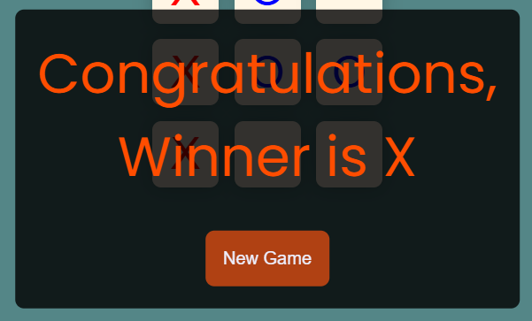
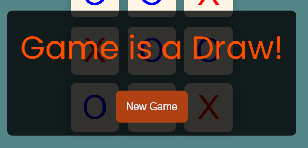
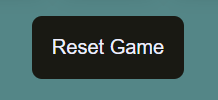

# Tic Tac Toe Game

## Overview
This is a two-player Tic Tac Toe game built with HTML, CSS, and JavaScript. Players take turns marking "X" or "O" on a 3x3 grid, with the game detecting wins, draws, and allowing resets. The project emphasizes modern web development practices, including accessibility, responsive design, and a clean user interface.

## Screenshort


## Features
- **Two-Player Mode**: Alternate between "X" (red) and "O" (blue) on each turn.

- **Win Detection**: Identifies a winner when three symbols align (rows, columns, or diagonals).


- **Draw Detection**: Declares a draw when the board is full with no winner.

- **Reset Functionality**: Offers "Reset Game" and "New Game" buttons to restart.

- **Responsive Design**: Adapts layout for desktop, tablet, and mobile devices.
- **Accessibility**: Includes ARIA roles and labels for screen reader support.

## Tech Stack
- **HTML5**: Semantic structure with accessibility enhancements.
- **CSS3**: Custom variables, flexbox, media queries, and transitions.
- **JavaScript (ES6+)**: Game logic with state management and event handling.

## Installation
1. Clone the repository:
   ```bash
   git clone https://github.com/AliDevHub/tic-tac-toe-game.git

## Contact
Feel free to reach out for collaboration or feedback: aliraza972003@gmail.com
